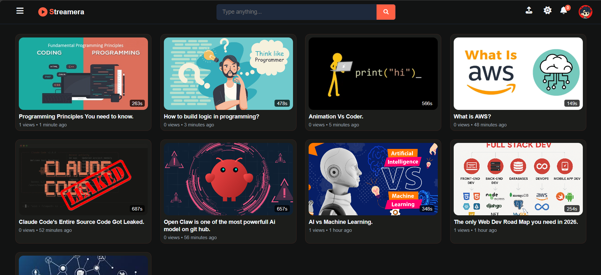
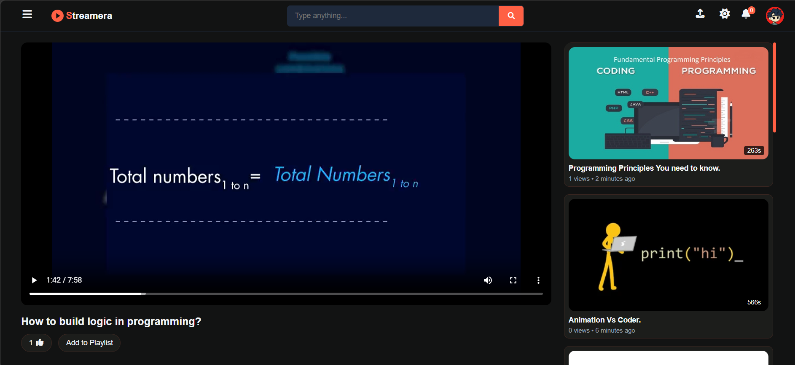
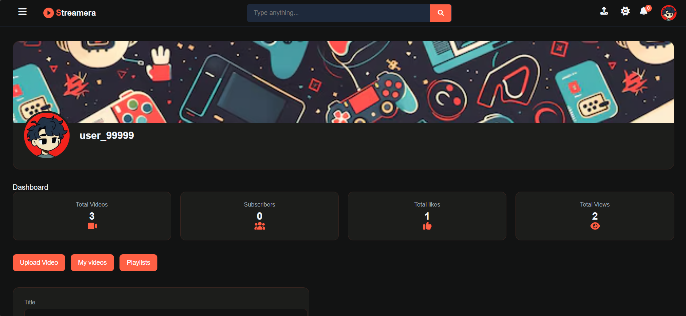
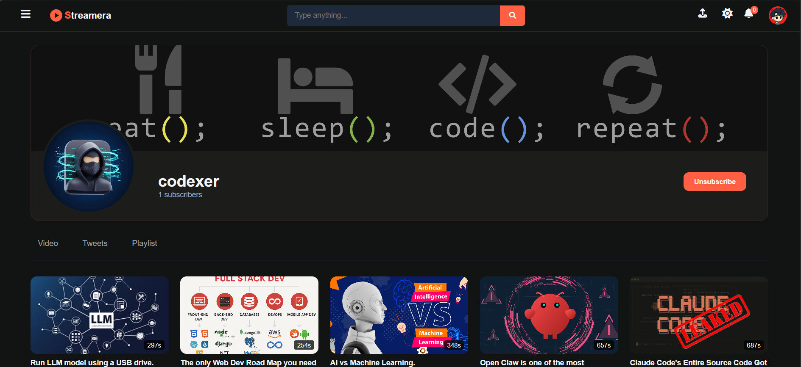
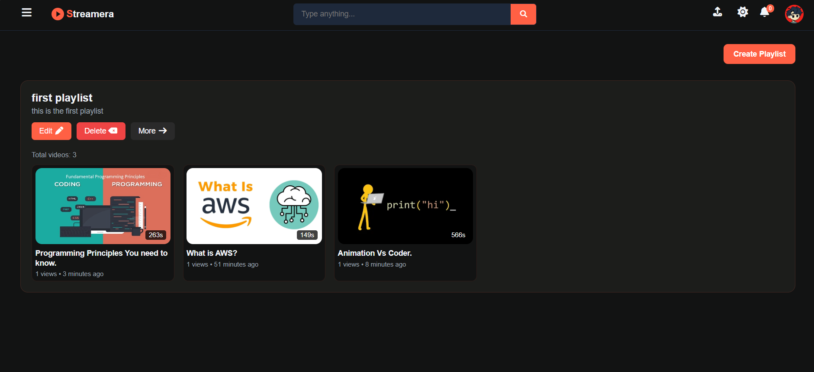
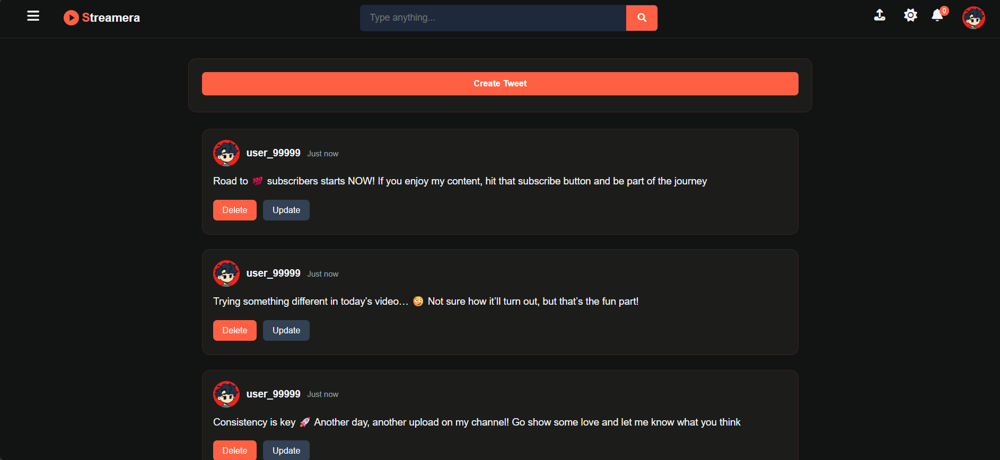

# 🎬 Streamera
### A full-stack video sharing app

[](https://streamera-mq1y.vercel.app/)
[](https://streamera.onrender.com)
[](https://github.com/Millindamb/Streamera)

---

## 📸 Screenshots

> _Add your screenshots here_

| Home | Watch | Dashboard |
|------|-------|-----------|
|  |  |  |

| Channel Profile | Playlists | Tweets |
|----------------|-----------|--------|
|  |  |  |

---

## ✨ Features

- 🔐 **User Authentication** — Register, login, logout with JWT-based access & refresh tokens
- 🎥 **Video Upload & Streaming** — Upload videos with thumbnails, stream directly in the browser
- 💬 **Comments** — Add, edit, and delete comments on videos
- 👍 **Likes** — Like/unlike videos
- 🔔 **Subscriptions** — Subscribe and unsubscribe to channels
- 📋 **Playlists** — Create playlists and add videos to them
- 🐦 **Tweets/Posts** — Post, update, and delete tweets on your channel
- 📊 **Dashboard** — View your total videos, subscribers, likes, and views at a glance

---

## 🛠️ Tech Stack

### Frontend
| Technology | Purpose |
|---|---|
| React.js | UI framework |
| React Router DOM | Client-side routing |
| Axios | HTTP requests |
| Font Awesome | Icons |
| CSS Modules | Styling |

### Backend
| Technology | Purpose |
|---|---|
| Node.js | Runtime |
| Express.js | Web framework |
| MongoDB + Mongoose | Database & ODM |
| JWT | Authentication |
| Cloudinary | Video & image storage |
| Multer | File upload handling |
| bcrypt | Password hashing |
| Cookie Parser | Cookie management |

---

## 🚀 Deployment

### Frontend — Vercel

1. Push your frontend code to GitHub
2. Import the repo on [vercel.com](https://vercel.com)
3. Set the following environment variable in Vercel dashboard:

```
VITE_API_URL=https://streamera.onrender.com
```

4. Add a `vercel.json` at the root of the frontend for React Router to work:

```json
{
  "rewrites": [
    { "source": "/(.*)", "destination": "/index.html" }
  ]
}
```

### Backend — Render

1. Push your backend code to GitHub
2. Create a new **Web Service** on [render.com](https://render.com)
3. Set the following environment variables in the Render dashboard:

```
MONGODB_URI=your_mongodb_connection_string
ACCESS_TOKEN_SECRET=your_access_token_secret
ACCESS_TOKEN_EXPIRY=1d
REFRESH_TOKEN_SECRET=your_refresh_token_secret
REFRESH_TOKEN_EXPIRY=10d
CLOUDINARY_CLOUD_NAME=your_cloudinary_cloud_name
CLOUDINARY_API_KEY=your_cloudinary_api_key
CLOUDINARY_API_SECRET=your_cloudinary_api_secret
CORS_ORIGIN=https://your-app.vercel.app
PORT=8000
```

> ⚠️ Render uses an ephemeral filesystem. Multer is configured to use `/tmp` for temporary file storage before uploading to Cloudinary.

---

## ⚙️ Local Setup

### Prerequisites
- Node.js v18+
- MongoDB Atlas account
- Cloudinary account

### 1. Clone the repository

```bash
git clone https://github.com/Millindamb/Streamera.git
cd Streamera
```

### 2. Setup Backend

```bash
cd Streamera_backend
npm install
```

Create a `.env` file in the backend root:

```env
PORT=8000
MONGODB_URI=mongodb+srv://<username>:<password>@cluster.mongodb.net/vediotube
ACCESS_TOKEN_SECRET=your_secret
ACCESS_TOKEN_EXPIRY=1d
REFRESH_TOKEN_SECRET=your_refresh_secret
REFRESH_TOKEN_EXPIRY=10d
CLOUDINARY_CLOUD_NAME=your_cloud_name
CLOUDINARY_API_KEY=your_api_key
CLOUDINARY_API_SECRET=your_api_secret
CORS_ORIGIN=http://localhost:5173
```

Start the backend:

```bash
npm run dev
```

### 3. Setup Frontend

```bash
cd Streamera_frontend
npm install
```

Create a `.env` file in the frontend root:

```env
VITE_API_URL=http://localhost:8000
```

Start the frontend:

```bash
npm run dev
```

---

## 📁 Project Structure

```
Streamera/
├── Streamera_backend/
│   ├── src/
│   │   ├── controllers/
│   │   ├── models/
│   │   ├── routes/
│   │   ├── middlewares/
│   │   └── utils/
│   └── package.json
│
└── Streamera_frontend/
    ├── src/
    │   ├── api/
    │   ├── components/
    │   ├── context/
    │   └── pages/
    └── package.json
```

---

## 🔐 Environment Variables Reference

| Variable | Description |
|---|---|
| `MONGODB_URI` | MongoDB Atlas connection string (include DB name before `?`) |
| `ACCESS_TOKEN_SECRET` | Secret key for signing access tokens |
| `ACCESS_TOKEN_EXPIRY` | Access token expiry (e.g. `1d`) |
| `REFRESH_TOKEN_SECRET` | Secret key for signing refresh tokens |
| `REFRESH_TOKEN_EXPIRY` | Refresh token expiry (e.g. `10d`) |
| `CLOUDINARY_CLOUD_NAME` | Your Cloudinary cloud name |
| `CLOUDINARY_API_KEY` | Your Cloudinary API key |
| `CLOUDINARY_API_SECRET` | Your Cloudinary API secret |
| `CORS_ORIGIN` | Frontend URL allowed by CORS |
| `PORT` | Port for the backend server |
| `VITE_API_URL` | Backend base URL (frontend only) |

---

## 👤 Author

**Millind Amb**
- GitHub: [@Millindamb](https://github.com/Millindamb)

---
